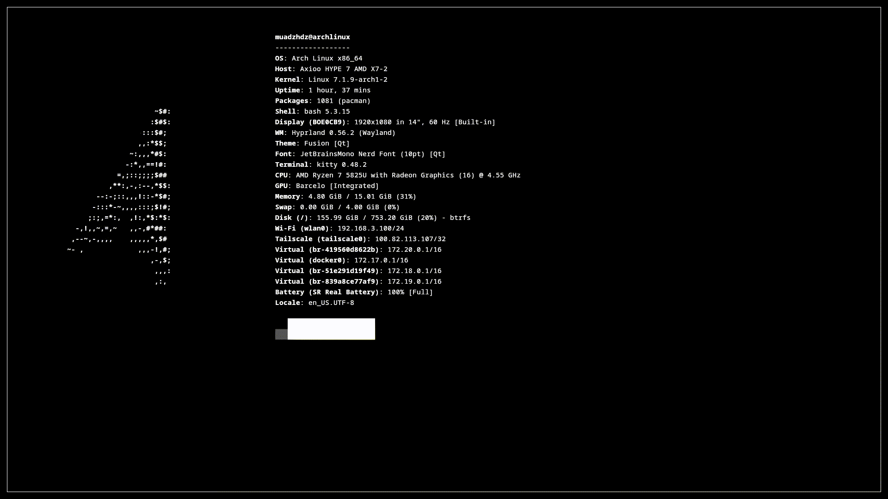

# dots

Personal Hyprland dotfiles — monochrome dark theme, no matugen.



## Install

```bash
git clone https://github.com/muadzhdz/dots && cd dots
./install.sh          # full install
./install.sh --check  # dry-run (preview only, no changes)
```

Requires Arch Linux with sudo. Installs everything: packages, AUR helpers (paru + yay), configs, PostgreSQL, MariaDB, UFW, plocate, nix, voxtype, fetch.

## What's inside

Hyprland, waybar, mako, rofi, kitty, ghostty, hyprlock, hypridle, swayosd, btop, cava, neovim, obs-studio, nix flake dev shell.

## Keybinds

| Key | Action |
|---|---|
| `SUPER + Return` | terminal |
| `SUPER + Space` | launcher |
| `SUPER + K` | keybinds menu |
| `SUPER + ALT + Space` | power menu |
| `SUPER + Q` | close |
| `SUPER + W` / `+ SHIFT + W` | random wallpaper / picker |
| `SUPER + ALT + W` | cycle waybar position |
| `SUPER + V` | clipboard history |
| `SUPER + S` | scratchpad |
| `SUPER + L` | lock |
| `SUPER + M` | exit |
| `Print` | screenshot |

## License

[MIT](LICENSE)
